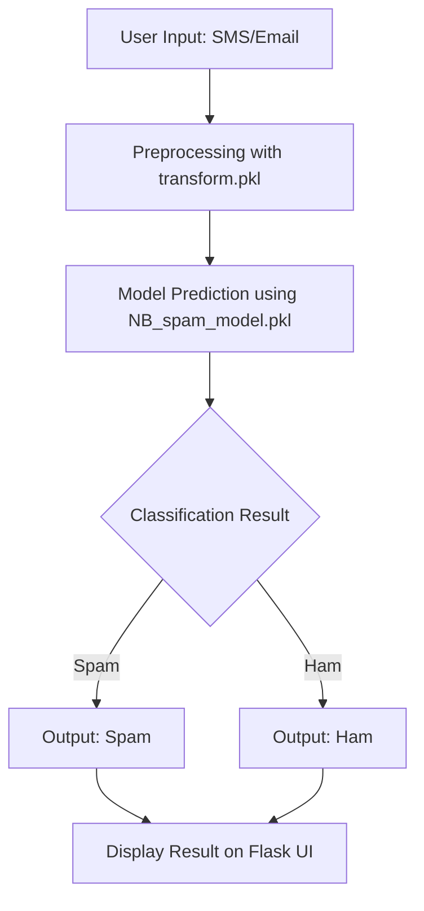

# 📧 SMS & Email Classifier

A machine learning project that classifies SMS messages and emails as **Spam** or **Ham (legitimate)**.  
This end-to-end solution combines **data preprocessing**, **model training**, and **deployment via Flask**, making it simple to test and use in real-world scenarios.

---

## 🚀 Features
- **Spam/Ham Classification**: Detects whether a message is spam or legitimate.  
- **Pre-trained Model**: Uses a Naive Bayes classifier trained on a large dataset.  
- **Web Interface**: Flask-powered frontend for easy interaction.  
- **Dataset Expansion**: Includes a script to generate larger datasets for experimentation.  
- **Deployment Ready**: Configured with `Procfile`, `requirements.txt`, and `runtime.txt` for platforms like Render/Heroku.  
- **Real-Time Prediction**: User inputs are classified instantly via the web app.  

---

## 📂 Project Structure
```
SMS-Email-Classifier/
│── static/                  # CSS, JS, and static assets
│── templates/               # HTML templates for Flask
│── venv/                    # Virtual environment (optional)
│── NB_spam_model.pkl        # Trained Naive Bayes model
│── transform.pkl            # Preprocessing transformer
│── spam_data.csv            # Dataset used for training
│── model_creation.py        # Script for training the model
│── generate_big_dataset.py  # Script to expand dataset
│── server.py                # Flask app entry point
│── requirements.txt         # Python dependencies
│── Procfile                 # Deployment instructions
│── runtime.txt              # Python runtime version
│── README.md                # Project documentation
│── LICENSE                  # MIT License
```

---

## ⚙️ Installation & Setup

### 1. Clone the repository
```bash
git clone https://github.com/your-username/SMS-Email-Classifier.git
cd SMS-Email-Classifier
```

### 2. Create a virtual environment
```bash
python -m venv venv
source venv/bin/activate   # On Linux/Mac
venv\Scripts\activate      # On Windows
```

### 3. Install dependencies
```bash
pip install -r requirements.txt
```

### 4. Run the Flask server
```bash
python server.py
```

The app will be available at:  
👉 `https://sms-email-classifier-p93k.onrender.com/`

---

## 🧠 Model Training
If you want to retrain the model:
```bash
python model_creation.py
```
- Uses `spam_data.csv` for training.  
- Saves the trained model as `NB_spam_model.pkl`.  
- Saves preprocessing pipeline as `transform.pkl`.

To expand the dataset:
```bash
python generate_big_dataset.py
```

---

## 🌐 Deployment
This project is deployment-ready with:
- **Procfile** → Defines the app entry point.  
- **requirements.txt** → Lists dependencies.  
- **runtime.txt** → Specifies Python version.  

You can deploy easily on **Render**, **Heroku**, or similar platforms.  
Once deployed, the app loads the saved model and transformer, classifying user inputs in real-time.

---

## 📸 Project Preview
Here’s a look at the application interface:

`[Looks like the result wasn't safe to show. Let's switch things up and try something else!]`

---

## 🔄 Process Flowchart



This flowchart shows the journey from **user input → preprocessing → model prediction → classification result → UI output**.

---

## 👨‍💻 Author
Developed by **[Bhandariq](https://github.com/Bhandariq)**  

---

👉 This version is **professional, detailed, and beginner-friendly**, with clear steps and placeholders for screenshots.  


